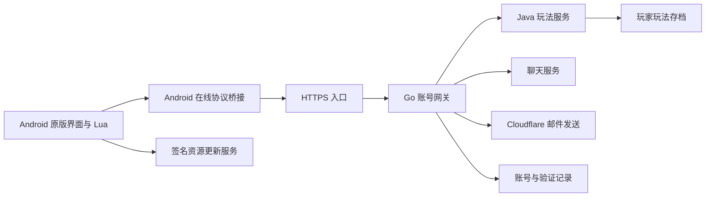

# 架构与目录

## 在线运行链

Go 负责账号、认证会话、公开 RID、邮箱验证码和密码找回，代理原游戏协议，提供管理后台。Java 处理背包、养成、战斗结算、任务、商店、抽卡、集会所与邮件等玩法事务。聊天进程使用独立数据目录，通过网关接入。

Android桥在回环TCP接口中代持当前会话，仍需补齐对同设备其他应用的调用隔离。它与服务端共享秘密及账号认证是不同边界，目前不能把本地监听地址当作应用身份校验。

资源更新服务独立于账号和玩法服务。客户端取得签名清单，校验公钥、版本、序号和每个文件的 SHA-256，下载完整覆盖集合。服务器的 `current` 指针只指向已验证的不可变版本目录。公钥可以交给客户端；签名私钥留在发布者本机。

## 本地模式

本地与在线入口共用原版服务器列表，通过不同说明标识区服。`local-mode/` 保存区服切换和桥接代码，电脑本地服务使用 Java 玩法服务。

本地模式不是“游客登录”入口；原游客图标和描述已隐藏。区服选择必须同时更新实际目标和保存的选区，避免从本地切回线上时仍指向本地。此前用户已确认两项区服及回切可用，本轮没有重新操作手机。

## 各目录用途

| 目录 | 内容 | 维护方式 |
| --- | --- | --- |
| `offline-preservation` | 原作者的 Android 2.0.1 单机化源码和剧情转换工具 | 按原 README 处理，保留历史，不以旧 STATUS 代表在线版现状 |
| `online/server` | Go 网关、后台静态页面、邮件系统、`cmd/chat` 和聊天实现 | 同一个 Go module；后台资源使用 `go:embed` |
| `online/legacy-server` | Java 原协议服务、玩法实现、目录配置、自测源码 | `Build.ps1` 为审阅稿的完整源码构建入口 |
| `online/android-client` | Android 桥接源码、Lua、配置与预制体处理、历史构建工具 | 顶层 `build_*.py`/`patch_*.py` 有互相导入，保持原层级 |
| `online/deploy/update-server` | 签名清单发布、验签、资源下载和回退工具 | 单独的 Go 命令；不带生产私钥或发布目录 |
| `online/scripts`、`online/tools` | 构建、数据生成、验证、历史整合脚本 | 必须先阅读脚本说明；不整目录批量运行 |
| `local-mode` | 双区服 APK 的 Java/Python 桥接与构建源码 | 作为 APK 整合构建链的一部分 |
| `experiments/activity` | 独立活动测试版的影子玩法服务和目录 | 独立应用、存档与测试配置，不自动合入正式服 |
| `experiments/stone-slate` | 未发布的石板玩法源码、测试与接线补丁 | 稳定构建没有启用这些接线 |

## Unity 工程

恢复工程中的 Unity 2017 项目和 Unity 6 阅读原型仍保留在本机 D 盘。当前正式 APK 修改主要采用已有 APK 的桥接、Lua、资源表与 AssetBundle 处理流程，不依赖用 Unity 编辑器重新导出完整游戏。

本审阅仓库没有复制 Unity 的大批原始资源、Library、导入缓存或二进制恢复成果。Unity 项目继续作为资源研究和后续恢复材料，不能把它称为完整、可直接重建正式 APK 的游戏工程。

## 稳定源码与历史工具

服务端完整构建使用稳定源码。历史 APK/服务端补丁工具常以已发布二进制和精确哈希作输入，有的还会转换源码后再编译。它们保留了修复过程，但不代表每一个 `build_*.py` 都能从这份仓库直接运行。

APK 内置版本、Android 安装版本码、签名资源序号与 Java JAR 哈希分别追踪，修改其中一个并不自动更新其他三个。
